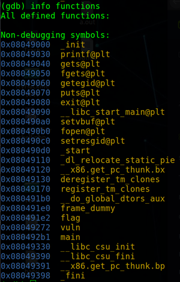
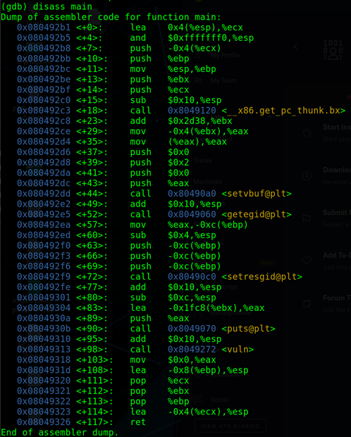
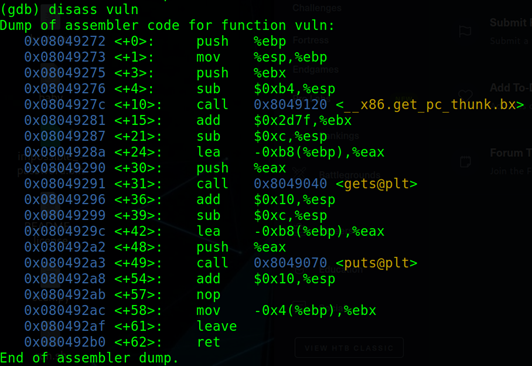
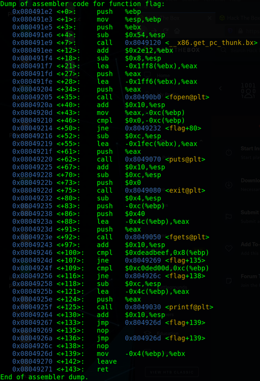

## Analysis of Protections

After downloading the binary, running checksec will show what protections were used with this file. **Stack canaries** are a value written into the stack that can be checked before a function returns to determine if a stack smashing attempt has occurred. **NX (no-execute)** sets a bit that marks certain areas of memory as non-executable to prevent code being maliciously written into the stack from being executed erroneously. **PIE (Position Independent Executable)** loads a binary and all dependencies into random locations within virtual memory each time the application is executed, making it difficult to pinpoint targets within an application. In this case, none of these protections are in place.

## Running The Executable

Running the executable gives the prompt &quot;You know who are 0xDiablos:&quot; and waits for user input. Entering the value of &quot;hello&quot; results in the application simply writing back &quot;hello&quot; to the terminal. Filling the buffer with a large amount of arbitrary data results in a segmentation fault, which indicates that a string operation is likely being conducted unsafely. This means there is potential for an overflow exploit.

## Decompiling With GDB

Running the file with GDB and dumping information about the functions may give insight about how the application is built. This file contains &#39;main&#39;, &#39;vuln&#39;, &#39;flag&#39;, and &#39;gets&#39;, the latter being an unsafe function and likely the source of the overflow vulnerability.

Disassembling main gives a better understanding of the code execution. Located at address 0x08049313 is a call to the &#39;vuln&#39; function.

Similarly, &#39;vuln&#39; can be disassembled for more information. The first four lines of &#39;vuln&#39; show the stack frame creation. When the call to &#39;vuln&#39; is executed, a return address is pushed onto the stack. Once inside the function, the old value of EBP is pushed to the stack, ESP is updated, EBX is pushed onto the stack, then ESP is moved 0xb4 bytes to make space for local variables. Later, the call to &#39;gets&#39; writes into this area on the stack. To attack this buffer one would need to overwrite 0xb4 (180) bytes, plus 4 bytes to overwrite EBX, plus another 8 bytes to overwrite EBP and the return address.

But what about the &#39;flag&#39; function? It never seems to be called anywhere. Disassembling &#39;flag&#39; reveals more information about what it&#39;s doing. At address 0x08049205 is a call to &#39;fopen&#39; and later at 0x0804923e is a call to &#39;fgets&#39;, so this function is opening and reading from a file. Following the call to &#39;fgets&#39; is a comparison of EBP+8 to &quot;0xdeadbeef&quot; and EBP+12 to &quot;0xc0ded00d&quot;. Should either of these comparisons fail a jump occurs to exit the function, but if both are successful a call to &#39;printf&#39; will execute. In x86 systems, function parameters are pushed onto the stack before a function call and are referenced within a function via offsets to EBP.

## Recap

Based on the analysis of the executable, here is what can be deduced:

1. The executable does not have any stack protection in place and the address space layout is not randomized. This means each instruction will always be at the same address in virtual memory.
2. &#39;vuln&#39; uses the unsafe function &#39;gets&#39; to read user input to a buffer. This can be exploited.
3. &#39;flag&#39; is never called directly, but it reads from a file, takes two parameters that are compared to &quot;0xdeadbeef&quot; and &quot;0xc0ded00d&quot;, and prints something out.

## Solution

The full writeup is locked with the flag. [See the full writeup][writeup_url]

[writeup_url]: ./You%20know%200xDiablos.pdf
